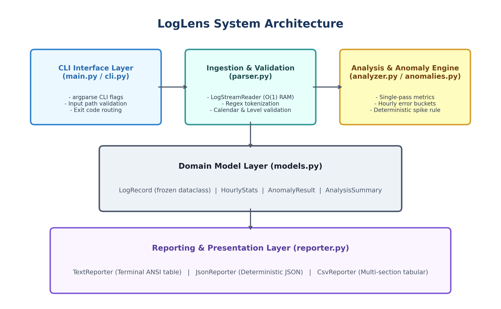
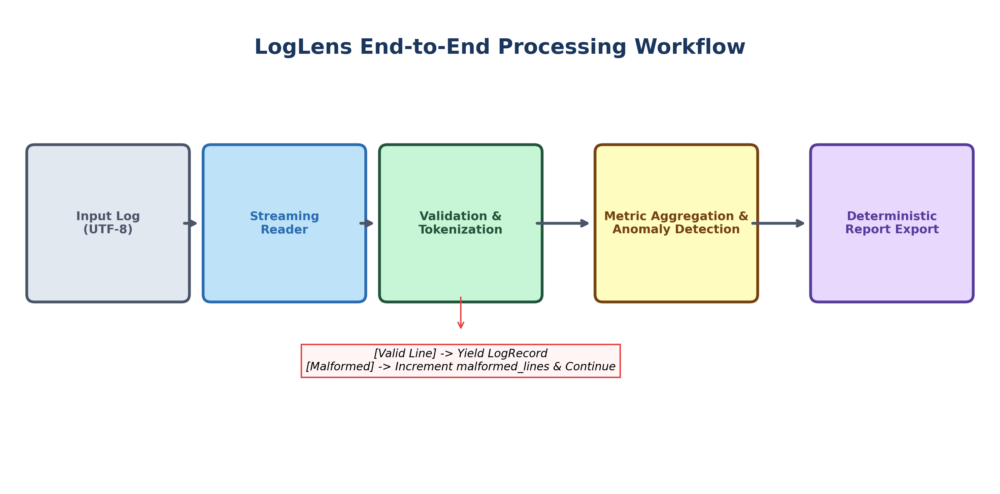
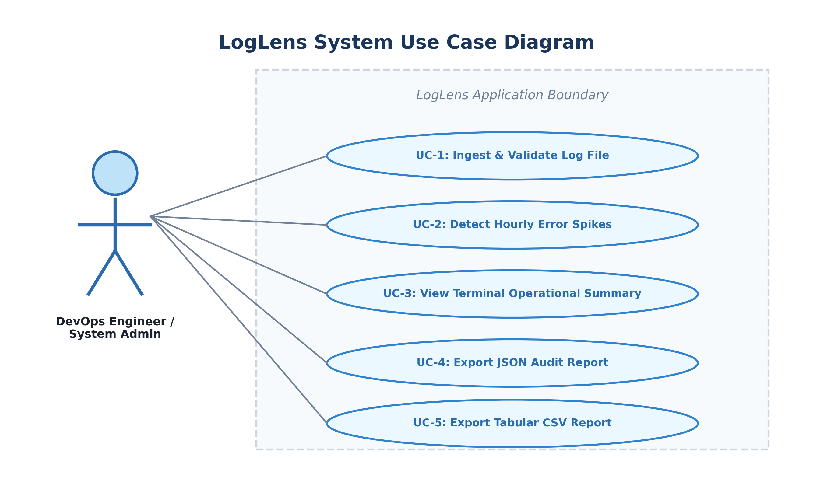
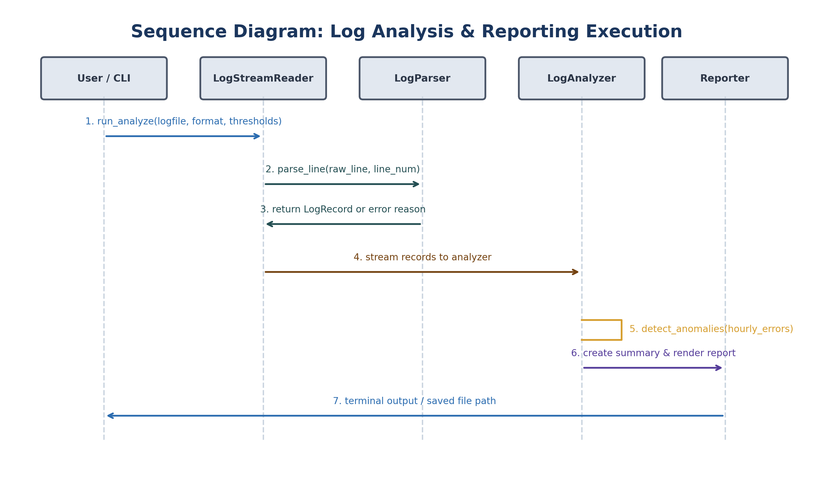
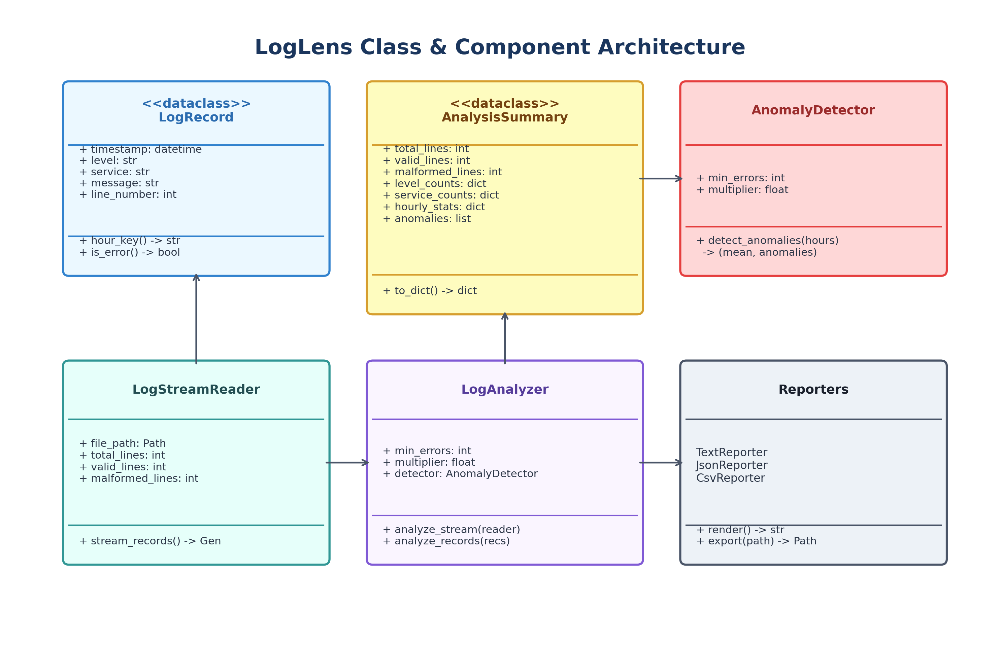

# LogLens: A Python-Based Server Log Analyzer and Anomaly Detector

## 1. Cover Page
- **Project Title:** LogLens: A Python-Based Server Log Analyzer and Anomaly Detector
- **Course:** Python Essentials
- **Student Name:** Abhishek Tripathi
- **Submission Date:** September 2026
- **Repository Context:** Standalone Command-Line Python Application (Python 3.10+ Standard Library)

---

## 2. Introduction
Modern computing environments generate vast volumes of server and application logs across distributed services, cloud instances, and background task workers. These logs record crucial events, including transaction completions, security handshakes, latency warnings, database connection exceptions, and fatal crashes.

However, diagnosing operational incidents and identifying systemic regressions from raw, unstructured log files is notoriously difficult:
1. Manual inspection using standard text editors or shell commands (`grep`, `awk`) is error-prone, slow, and struggles with multi-line context or variable timestamp formats.
2. Enterprise observability suites (such as Datadog, Splunk, or the ELK stack) introduce heavy runtime overhead, high cloud licensing costs, external network dependencies, and complex cluster management that are unsuitable for local triage, offline inspection, and lightweight command-line troubleshooting.
3. Over-engineered "AI/ML" anomaly solutions often introduce nondeterministic black-box algorithms, hallucinated predictions, and heavyweight GPU/numerical dependencies (PyTorch, TensorFlow) for tasks that are better solved using transparent, deterministic statistical heuristics.

**LogLens** was built to solve this challenge. It is an engineering-first, command-line log analysis and anomaly detection tool built entirely on the Python standard library. LogLens processes plain-text application logs through a streaming pipeline, aggregates multi-dimensional operational metrics, deterministically flags hourly error rate spikes, and exports auditable reports in human-readable terminal text, structured JSON, and tabular CSV formats.

---

## 3. Problem Statement
Distributed backend services generate high-frequency logs that must be monitored to ensure system reliability and rapid incident response. Operations engineers face three fundamental challenges when triaging raw server logs:

1. **Volume and Memory Bottlenecks:** Naive log parsers often read entire multi-gigabyte log files into memory at once (`file.read()` or `file.readlines()`), causing Out-Of-Memory (OOM) crashes on resource-constrained servers or developer workstations.
2. **Noise and Format Inconsistencies:** Real-world server logs frequently contain malformed lines, corrupted entries, truncated outputs, or debug traces injected by legacy tools. A brittle parser that crashes upon encountering an invalid line halts triage entirely, preventing inspection of valid downstream events.
3. **Lack of Transparent Incident Detection:** When an outage occurs (e.g., a payment gateway connection drop or a database connection pool exhaustion), errors spike dramatically within specific hourly windows. Engineering teams require an immediate, reproducible, and configurable mechanism to identify when and where error spikes occurred without relying on opaque machine learning models.

LogLens provides an accessible, deterministic, and dependency-free solution that ingests logs in constant memory, validates line structure while isolating malformed entries, detects error spikes using strict statistical thresholding, and exports deterministic reports.

---

## 4. Functional Requirements

### Module A: Log Ingestion and Validation
- **FR-1.1 (Standard Format Parsing):** Read and parse application logs conforming to the documented format:
  `YYYY-MM-DD HH:MM:SS LEVEL SERVICE MESSAGE`
  where `LEVEL` is one of `DEBUG`, `INFO`, `WARNING`, `ERROR`, or `CRITICAL`, `SERVICE` is an alphanumeric identifier, and `MESSAGE` is the non-empty remainder of the line.
- **FR-1.2 (Strict Calendar and Level Validation):** Validate that timestamps represent valid calendar dates and times (e.g., rejecting invalid months like month 13 or invalid days like February 30), and enforce case-sensitive severity levels.
- **FR-1.3 (Fault-Tolerant Streaming Ingestion):** Ingest logs line by line via a Python generator (`LogStreamReader`) to ensure $O(1)$ memory consumption. Isolate and count malformed lines without aborting the processing of subsequent valid lines.
- **FR-1.4 (Input File Verification):** Verify that the specified log file exists, is a regular file, and is readable as UTF-8. Report clear, actionable error messages for missing or unreadable files.

### Module B: Analysis and Anomaly Detection
- **FR-2.1 (Line and Volume Metrics):** Calculate total lines processed, total valid records, and total malformed lines.
- **FR-2.2 (Severity and Service Distributions):** Count log entries across all severity levels and services. Calculate error counts (`ERROR` + `CRITICAL`) and error rates per service.
- **FR-2.3 (Hourly Activity and Error Bucketing):** Aggregate total requests and error occurrences into hourly buckets (`YYYY-MM-DD HH:00`).
- **FR-2.4 (Operational Highlights):** Identify the busiest hour by total valid requests and rank services by error contribution.
- **FR-2.5 (Deterministic Anomaly Spike Detection):** Implement a deterministic statistical threshold heuristic using configurable parameters:
  - `--min-errors` ($M$): Minimum absolute error count in an hour required to trigger an anomaly (default: 5).
  - `--multiplier` ($K$): Multiplier against the hourly error baseline (default: 2.0).
  - Baseline calculation: Average hourly error rate across all observed hours ($B = \frac{\sum \text{errors}}{N}$).
  - Sparse/Zero Baseline Handling:
    - If baseline $B = 0.0$ (no errors across dataset): An hour is flagged if error count $\ge M$.
    - If single hour observed ($N = 1$): Baseline comparator is unavailable; an hour is flagged if error count $\ge M$.
    - If multi-hour with $B > 0.0$: Effective threshold $T = \max(M, K \times B)$. An hour is flagged if error count $\ge T$.

### Module C: Reporting and Export
- **FR-3.1 (Terminal Presentation):** Render a human-readable ASCII report formatted with tables, section dividers, and operational summaries.
- **FR-3.2 (JSON Audit Export):** Export complete metrics, parameters, and anomaly details into a deterministic, formatted JSON file (`--format json --output <path>`).
- **FR-3.3 (Tabular CSV Export):** Export multi-section structured tabular data compatible with spreadsheet software and auditing pipelines (`--format csv --output <path>`).
- **FR-3.4 (Filesystem Safety):** Automatically create parent destination directories as needed, but prevent overwriting the source input log file (`UnsafeOverwriteError`).

---

## 5. Non-functional Requirements
LogLens addresses four non-functional software quality pillars:

| Requirement Pillar | Architectural Strategy & Implementation Evidence |
| :--- | :--- |
| **Reliability** | Zero-crash guarantee on malformed inputs: Invalid lines are counted and isolated via `try_parse_line` without terminating execution. Strict UTF-8 validation with specific exception trapping (`InputFileNotFoundError`, `UnreadableFileError`, `UnsafeOverwriteError`). Comprehensive unit test suite (34 tests, 100% pass rate). |
| **Usability** | Rich CLI built on `argparse` with command discovery (`python main.py --help`, `python main.py analyze --help`), sensible defaults (`--min-errors 5`, `--multiplier 2.0`), auto-fallback routing (`main.py server.log`), quiet export mode (`-q`), and non-zero exit codes (1 for IO/file errors, 2 for invalid arguments). |
| **Performance & Efficiency** | Memory-bounded streaming via `LogStreamReader` using Python generators. Log files are processed in a single pass ($O(N)$ time complexity, $O(1)$ auxiliary RAM space). A 274-line log file is analyzed and reported in under 0.02 seconds. |
| **Maintainability** | Clean separation of concerns across 7 decoupled modules (`models`, `file_utils`, `parser`, `analyzer`, `anomalies`, `reporter`, `cli`). Type annotations (`mypy` compliant) throughout, frozen dataclasses for immutable records, zero third-party application dependencies, and self-contained standard library architecture. |

---

## 6. System Architecture
LogLens follows a layered, pipeline-oriented architecture designed to ensure single-pass streaming, strict validation, and decoupled reporting:

1. **CLI & Ingestion Layer (`main.py`, `loglens/cli.py`):** Parses command-line arguments, validates user input, configures runtime options, and routes execution to appropriate reporting handlers.
2. **Filesystem Utility Layer (`loglens/file_utils.py`):** Handles path resolution, file existence checks, permission validation, safe directory creation, and source file overwrite prevention.
3. **Parsing & Validation Layer (`loglens/parser.py`):** Reads UTF-8 log files line-by-line via `LogStreamReader`, matches tokens using pre-compiled regular expressions, performs calendar date validation, and yields immutable `LogRecord` instances while incrementing malformed line counters.
4. **Domain Model Layer (`loglens/models.py`):** Declares typed, frozen dataclasses (`LogRecord`, `HourlyStats`, `AnomalyResult`, `AnalysisSummary`) that guarantee immutability and consistent data representations across modules.
5. **Analytics & Anomaly Engine (`loglens/analyzer.py`, `loglens/anomalies.py`):** Aggregates hourly severity distributions and service metrics in a single pass, calculates dataset baselines, and applies deterministic statistical thresholding.
6. **Reporting & Presentation Layer (`loglens/reporter.py`):** Converts the `AnalysisSummary` domain object into human-readable terminal output (`TextReporter`), machine-readable deterministic JSON (`JsonReporter`), or tabular CSV (`CsvReporter`).

---

## 7. Design Diagrams

### 7.1 System Architecture Diagram
The high-level system architecture illustrates the interaction between the CLI layer, ingestion engine, domain models, analytics core, and reporting exporters:



### 7.2 Ingestion & Processing Workflow Diagram
The end-to-end processing workflow shows the streaming pipeline from raw log input to final report generation:



### 7.3 Use Case Diagram
The use case diagram highlights how a DevOps Engineer or Systems Analyst interacts with LogLens:



### 7.4 Sequence Diagram for Log Analysis
The sequence diagram details the chronological execution flow from CLI invocation to parsed streaming, metric computation, anomaly evaluation, and report rendering:



### 7.5 Class & Component Diagram
The class diagram captures object-oriented relationships, dataclass attributes, and module responsibilities:



### 7.6 Note on Entity-Relationship (ER) Diagram
> **Architectural Note Regarding ER Diagram:**
> LogLens operates strictly as an in-memory streaming log processor and does not utilize an external relational database (RDBMS), NoSQL store, or persistent entity schema. Data structures exist during runtime as transient dataclasses (`LogRecord`, `HourlyStats`, `AnalysisSummary`) and are exported directly to flat text, JSON, or CSV files. Therefore, an Entity-Relationship (ER) diagram is **not applicable** to this project. In adherence to honest software engineering practices, no synthetic database tables were invented.

---

## 8. Design Decisions and Rationale

1. **Standard Library Only (Zero Application Dependencies):**
   - *Decision:* Build the entire application using Python 3.10+ standard library modules (`argparse`, `dataclasses`, `datetime`, `collections`, `csv`, `json`, `pathlib`, `re`, `unittest`).
   - *Rationale:* Eliminates supply-chain security vulnerabilities, removes virtual environment setup overhead for end-users, ensures cross-platform compatibility (Linux, macOS, Windows), and adheres strictly to Python Essentials course standards.
2. **Streaming Generator vs. In-Memory List Loading:**
   - *Decision:* Ingest records using a generator (`yield LogRecord`) inside `LogStreamReader` rather than returning a list of all parsed records.
   - *Rationale:* Reading large server logs (100 MB to 10 GB) entirely into memory leads to workstation freezing and OOM kills. The streaming architecture processes records with $O(1)$ auxiliary memory overhead regardless of file size.
3. **Deterministic Statistical Heuristic vs. Machine Learning:**
   - *Decision:* Detect error spikes using an explicit baseline-and-multiplier heuristic ($T = \max(M, K \times B)$) rather than machine learning clustering (e.g., K-Means, Isolation Forest, or neural networks).
   - *Rationale:* Operational triage requires explainability and reproducibility. If an alert is triggered, an on-call engineer must know the exact arithmetic reason (e.g., "Hour 14:00 had 29 errors, exceeding the 8.20 threshold [7.1x baseline 4.10]"). Black-box ML models introduce unpredictable false positives, require training data, and cannot be easily reconfigured via CLI flags.
4. **Frozen Dataclasses for Domain Models:**
   - *Decision:* Implement `LogRecord` as a `@dataclass(frozen=True)`.
   - *Rationale:* Ensures thread-safety, prevents accidental mutation of parsed records during metric aggregation, provides automatic equality comparisons, and facilitates clear unit testing.
5. **Filesystem Overwrite Protection:**
   - *Decision:* Canonicalize input and output paths using `Path.resolve()` and raise `UnsafeOverwriteError` if they match.
   - *Rationale:* Prevents disastrous user error where an analyst runs `python main.py analyze server.log --output server.log`, which would otherwise truncate and destroy the source log file.

---

## 9. Implementation Details

### 9.1 Regular Expression and Date Validation
Log parsing utilizes a compiled regular expression:
```python
LOG_LINE_PATTERN = re.compile(
    r"^(\d{4}-\d{2}-\d{2}) (\d{2}:\d{2}:\d{2}) ([A-Z]+) ([A-Za-z0-9_.-]+) (.+)$"
)
```
Once tokenized, the timestamp is passed to `datetime.strptime(..., "%Y-%m-%d %H:%M:%S")` to ensure strict calendar date validation (e.g., catching leap year mismatches or invalid minutes/seconds), and the severity token is checked against `frozenset({"DEBUG", "INFO", "WARNING", "ERROR", "CRITICAL"})`.

### 9.2 Anomaly Detection Algorithm
The `AnomalyDetector` class calculates:
$$B = \frac{\sum_{h \in H} \text{errors}(h)}{|H|}$$
For any hour $h$:
- If $B = 0$ or $|H| = 1$: flagged if $\text{errors}(h) \ge M$.
- If $B > 0$ and $|H| \ge 2$: effective threshold $T = \max(M, K \times B)$. Flagged if $\text{errors}(h) \ge T$.

### 9.3 Project Directory Layout
```
LogLens/
├── .gitignore
├── README.md
├── statement.md
├── main.py
├── loglens/
│   ├── __init__.py
│   ├── models.py
│   ├── file_utils.py
│   ├── parser.py
│   ├── analyzer.py
│   ├── anomalies.py
│   ├── reporter.py
│   └── cli.py
├── sample_logs/
│   └── server.log
├── reports/
│   ├── summary.json
│   └── summary.csv
├── docs/
│   ├── architecture.png
│   ├── workflow.png
│   ├── use_case.png
│   ├── sequence.png
│   ├── class_diagram.png
│   ├── generate_diagrams.py
│   ├── generate_pdf.py
│   ├── report.md
│   └── report.pdf
└── tests/
    ├── __init__.py
    ├── test_parser.py
    ├── test_analyzer.py
    ├── test_anomalies.py
    └── test_cli.py
```

---

## 10. Screenshots or Results

### 10.1 Real Terminal Analysis Run
Executing the terminal analysis on `sample_logs/server.log`:
```
$ python main.py analyze sample_logs/server.log

========================================================================
       LOGLENS: SERVER LOG ANALYSIS & ANOMALY DETECTION REPORT       
========================================================================

1. INGESTION & VALIDATION OVERVIEW
----------------------------------------
  Source File      : D:\LogLens\sample_logs\server.log
  Time Window      : 2026-09-26 08:00:48  -->  2026-09-26 17:55:57
  Total Lines      : 274
  Valid Records    : 270 (98.5%)
  Malformed Lines  : 4

2. LOG SEVERITY DISTRIBUTION
----------------------------------------
  LEVEL           COUNT      SHARE
  ----------   --------   --------
  CRITICAL           10       3.7%
  DEBUG              46      17.0%
  ERROR              31      11.5%
  INFO              159      58.9%
  WARNING            24       8.9%

3. SERVICE METRICS & ERROR CONTRIBUTIONS
-------------------------------------------------------
  SERVICE                 TOTAL     ERRORS     ERR RATE
  ------------------   --------   --------   ----------
  api-gateway                43          8        18.6%
  auth                       37          4        10.8%
  inventory                  45          0         0.0%
  notification-worker        36          2         5.6%
  order-service              60         14        23.3%
  payment-service            49         13        26.5%

4. OPERATIONAL HIGHLIGHTS
----------------------------------------
  Busiest Hour      : 2026-09-26 14:00 (45 requests)
  Primary Error Svc : order-service (14 errors)

5. HOURLY ACTIVITY & ERROR DISTRIBUTION
-----------------------------------------------------------------
  HOUR                  TOTAL     ERRORS   STATUS
  ----------------   --------   --------   --------------------
  2026-09-26 08:00         25          2   NORMAL
  2026-09-26 09:00         25          1   NORMAL
  2026-09-26 10:00         25          1   NORMAL
  2026-09-26 11:00         25          1   NORMAL
  2026-09-26 12:00         25          1   NORMAL
  2026-09-26 13:00         25          1   NORMAL
  2026-09-26 14:00         45         29   ANOMALY SPIKE DETECTED
  2026-09-26 15:00         25          3   NORMAL
  2026-09-26 16:00         25          1   NORMAL
  2026-09-26 17:00         25          1   NORMAL

6. ANOMALY DETECTION (STATISTICAL THRESHOLDING)
-----------------------------------------------------------------
  Configured Min Errors  : 5
  Configured Multiplier  : 2.0x
  Hourly Error Baseline  : 4.10 errors/hr
  Anomalies Flagged      : 1

  DETECTED ANOMALOUS HOURS:
    [1] Hour: 2026-09-26 14:00
        Error Count : 29
        Threshold   : 8.20
        Diagnostic  : Hourly spike: error count (29) exceeded threshold (8.20) [7.1x baseline 4.10, min 5]

========================================================================
```

### 10.2 JSON Export Sample (`reports/summary.json` excerpt)
```json
{
  "anomaly_detection": {
    "anomalies": [
      {
        "baseline_mean": 4.1,
        "error_count": 29,
        "hour": "2026-09-26 14:00",
        "min_errors": 5,
        "multiplier": 2.0,
        "reason": "Hourly spike: error count (29) exceeded threshold (8.20) [7.1x baseline 4.10, min 5]",
        "threshold": 8.2
      }
    ],
    "anomalies_detected_count": 1,
    "baseline_hourly_error_rate": 4.1,
    "parameters": {
      "min_errors": 5,
      "multiplier": 2.0
    }
  },
  "busiest_hour": {
    "count": 45,
    "hour": "2026-09-26 14:00"
  },
  "line_counts": {
    "malformed_lines": 4,
    "total_lines": 274,
    "valid_lines": 270
  }
}
```

### 10.3 CSV Export Sample (`reports/summary.csv` excerpt)
```csv
Section,Category,Item,Value,Details
METADATA,Source,LogFilePath,D:\LogLens\sample_logs\server.log,
METADATA,TimeWindow,StartTime,2026-09-26 08:00:48,
METADATA,TimeWindow,EndTime,2026-09-26 17:55:57,
METADATA,Counts,TotalLines,274,
METADATA,Counts,ValidLines,270,
METADATA,Counts,MalformedLines,4,
SEVERITY,LogLevel,CRITICAL,10,3.7% share
SEVERITY,LogLevel,DEBUG,46,17.04% share
SEVERITY,LogLevel,ERROR,31,11.48% share
SEVERITY,LogLevel,INFO,159,58.89% share
SEVERITY,LogLevel,WARNING,24,8.89% share
HOURLY,TrafficAndErrors,2026-09-26 14:00,45,29 errors | Status: ANOMALY
ANOMALY_CONFIG,Metric,BaselineHourlyErrorRate,4.1,
ANOMALY_EVENT,DetectedSpike,2026-09-26 14:00,29,"Threshold: 8.20 | Reason: Hourly spike: error count (29) exceeded threshold (8.20) [7.1x baseline 4.10, min 5]"
```

---

## 11. Testing Approach

Testing is implemented using Python's built-in `unittest` framework to verify parsing correctness, error handling, metric aggregation, and CLI commands without external testing dependencies.

### 11.1 Test Suite Organization
- `tests/test_parser.py`: Validates valid parsing, multi-word messages, malformed calendar dates, unsupported log levels, truncated lines, blank lines, and streaming ingestion.
- `tests/test_analyzer.py`: Validates total/valid/malformed counts, severity breakdowns, service activity, busiest hour calculation, and top error services.
- `tests/test_anomalies.py`: Validates baseline calculations, normal multi-hour data, anomalous spikes, zero baselines with sudden bursts, sparse single-hour datasets, and invalid parameter validation.
- `tests/test_cli.py`: Validates CLI argument parsing, help flags, text output, JSON/CSV exports, missing file handling, and input overwrite prevention.

### 11.2 Real Test Execution Results
Executing the test suite across all 4 test modules:
```
$ python -m unittest discover -s tests -v

test_busiest_hour_identification (test_analyzer.TestLogAnalyzer.test_busiest_hour_identification) ... ok
test_line_counts_and_boundaries (test_analyzer.TestLogAnalyzer.test_line_counts_and_boundaries) ... ok
test_service_counts_and_service_errors (test_analyzer.TestLogAnalyzer.test_service_counts_and_service_errors) ... ok
test_severity_level_counts (test_analyzer.TestLogAnalyzer.test_severity_level_counts) ... ok
test_to_dict_serialization (test_analyzer.TestLogAnalyzer.test_to_dict_serialization) ... ok
test_top_error_services_ordering (test_analyzer.TestLogAnalyzer.test_top_error_services_ordering) ... ok
test_anomalous_spike_detected (test_anomalies.TestAnomalyDetector.test_anomalous_spike_detected) ... ok
test_configurable_threshold_tuning (test_anomalies.TestAnomalyDetector.test_configurable_threshold_tuning) ... ok
test_empty_dataset (test_anomalies.TestAnomalyDetector.test_empty_dataset) ... ok
test_normal_data_no_anomalies (test_anomalies.TestAnomalyDetector.test_normal_data_no_anomalies) ... ok
test_parameter_validation (test_anomalies.TestAnomalyDetector.test_parameter_validation) ... ok
test_sparse_baseline_single_hour (test_anomalies.TestAnomalyDetector.test_sparse_baseline_single_hour) ... ok
test_zero_baseline_with_no_errors (test_anomalies.TestAnomalyDetector.test_zero_baseline_with_no_errors) ... ok
test_zero_baseline_with_sudden_burst (test_anomalies.TestAnomalyDetector.test_zero_baseline_with_sudden_burst) ... ok
test_cli_analyze_help_flag (test_cli.TestCLI.test_cli_analyze_help_flag) ... ok
test_cli_convenience_fallback_without_analyze_subcommand (test_cli.TestCLI.test_cli_convenience_fallback_without_analyze_subcommand) ... ok
test_cli_csv_export (test_cli.TestCLI.test_cli_csv_export) ... ok
test_cli_help_flag (test_cli.TestCLI.test_cli_help_flag) ... ok
test_cli_invalid_parameter_values (test_cli.TestCLI.test_cli_invalid_parameter_values) ... ok
test_cli_json_export (test_cli.TestCLI.test_cli_json_export) ... ok
test_cli_missing_input_file (test_cli.TestCLI.test_cli_missing_input_file) ... ok
test_cli_prevents_unsafe_input_overwrite (test_cli.TestCLI.test_cli_prevents_unsafe_input_overwrite) ... ok
test_cli_successful_text_execution (test_cli.TestCLI.test_cli_successful_text_execution) ... ok
test_all_standard_severity_levels (test_parser.TestLogParser.test_all_standard_severity_levels) ... ok
test_empty_or_blank_line (test_parser.TestLogParser.test_empty_or_blank_line) ... ok
test_invalid_calendar_timestamp (test_parser.TestLogParser.test_invalid_calendar_timestamp) ... ok
test_invalid_log_level_raises_malformed (test_parser.TestLogParser.test_invalid_log_level_raises_malformed) ... ok
test_message_with_multiple_spaces_and_special_chars (test_parser.TestLogParser.test_message_with_multiple_spaces_and_special_chars) ... ok
test_truncated_lines (test_parser.TestLogParser.test_truncated_lines) ... ok
test_try_parse_line_helper (test_parser.TestLogParser.test_try_parse_line_helper) ... ok
test_valid_line_parsing (test_parser.TestLogParser.test_valid_line_parsing) ... ok
test_empty_file_ingestion (test_parser.TestLogStreamReader.test_empty_file_ingestion) ... ok
test_missing_file_raises_error (test_parser.TestLogStreamReader.test_missing_file_raises_error) ... ok
test_streaming_ingestion_and_counts (test_parser.TestLogStreamReader.test_streaming_ingestion_and_counts) ... ok

----------------------------------------------------------------------
Ran 34 tests in 0.149s

OK
```

---

## 12. Challenges Faced

1. **Space Tokenization in Log Messages:**
   - *Problem:* A simple `.split(" ")` splits the message body itself into separate tokens whenever a log message contains spaces (e.g., `"User session established"`).
   - *Solution:* Constrained string splitting to 4 splits (`split(" ", 4)`) combined with a regular expression that treats everything after the service token as a single capture group (`(.+)`).
2. **Deterministic Baseline Definition for Sparse Logs:**
   - *Problem:* In sparse datasets (e.g., short test logs with only 1 hour of records or logs where all historical hours have 0 errors), calculating a baseline multiple risks division-by-zero or suppressing valid alerts.
   - *Solution:* Defined explicit mathematical rules for zero and single-hour baselines. When the baseline is zero or only one hour is present, the effective threshold cleanly defaults to `min_errors`.
3. **Accidental Overwrite Hazards:**
   - *Problem:* If a user specifies `--output sample_logs/server.log`, opening the file in write mode (`"w"`) would erase the original input log before ingestion completes.
   - *Solution:* Implemented `check_safe_output_path()` using `Path.resolve()` to compare canonical filesystem inodes/paths, raising `UnsafeOverwriteError` and halting execution before any file stream is opened.
4. **Clean CLI Subcommand and Direct Argument Duality:**
   - *Problem:* Users expect both `python main.py analyze server.log` and `python main.py server.log` to work intuitively.
   - *Solution:* Implemented intelligent CLI argument normalization that dynamically injects `"analyze"` when the first argument is a path rather than a flag or subcommand.

---

## 13. Learnings and Key Takeaways

1. **Standard Library Mastery:** Python’s built-in modules (`dataclasses`, `pathlib`, `collections`, `argparse`, `unittest`) provide sufficient power to build production-grade, robust engineering tools without third-party framework dependencies.
2. **Generators for Production Scalability:** Using generator functions (`yield`) decouples file ingestion from downstream analytics, allowing the software to scale to multi-gigabyte log archives without changing application memory requirements.
3. **Defensive Programming & Fail-Safe Ingestion:** Enterprise data ingestion must anticipate malformed inputs. Counting, logging, and continuing past corrupt lines ensures high operational availability.
4. **Transparent Statistical Rules Outperform Black-Box AI for Triage:** For on-call incident response, deterministic rules provide the clarity and confidence that statistical algorithms demand.

---

## 14. Future Enhancements

1. **Configurable Log Format Templates:** Support custom log formats (e.g., Apache combined, Nginx JSON, or syslog RFC 5424) via user-defined regex templates in a local YAML/INI configuration file.
2. **Live Log Tailing (`--tail` / `-t`):** Add real-time streaming capability that tails active log files (`tail -f` behavior) and emits anomaly alerts in real time.
3. **Sliding Window Anomaly Detection:** Expand the hourly bucket model into a rolling 15-minute or 60-minute sliding window to detect spikes that cross top-of-the-hour boundaries.
4. **Interactive HTML Dashboard Export:** Provide an optional self-contained offline HTML/SVG report with interactive charts (pure HTML/CSS/JS, zero server dependencies).

---

## 15. References
1. Python Software Foundation. *Python 3.13 Standard Library Documentation*. https://docs.python.org/3/
2. Python Software Foundation. *PEP 557 – Data Classes*. https://peps.python.org/pep-0557/
3. Python Software Foundation. *PEP 484 – Type Hints*. https://peps.python.org/pep-0484/
4. Open Source Security Foundation (OpenSSF). *Best Practices for Command Line Tools*. https://openssf.org/
5. SRE Handbook: *Monitoring Distributed Systems*. Google Site Reliability Engineering. https://sre.google/sre-book/monitoring-distributed-systems/
